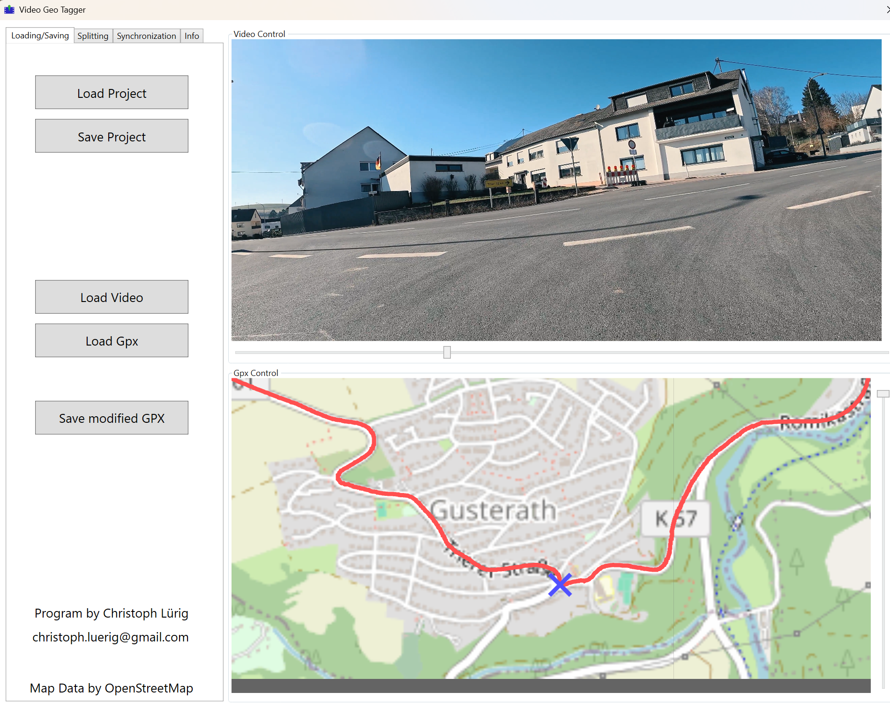

# VideoGeoTagger
Program to geo-tag a video with a Gpx file that has not been shot continuously. The program Needs an internet connection for the Maps to run.

## Screenshot

## Overview
The program synchronizes a GPX file with a potentially cut movie for geotagging. First, you load a video and a GPX file. Then, you define splitting points where you have cut the video, and finally, you geotag every resulting segment.

## Preparation
After you have loaded the video and the GPX file, you may save your work anytime with "Save Project" and load it later on with "Load Project". You will do the bulk of the work in the video control and the GPX control window. You may move around the video by dragging the slider and with the cursor keys. The GPX control supports dragging with the middle mouse button. Zooming is done with the mouse wheel or the slider on the side. Later, you may set a reference marker by clicking on the map.

## Splitting
You have to create splittings if you edited your video and cut things out (like waiting at a red traffic light). Navigate your video to the points where you have created a cut. Mark those points with the button "Create Splitting Point." If you select one splitting point in the list, the footage jumps directly to the corresponding position. You can remove erroneously defined splitting points with "Delete Splitting Point." You can skip this stage if you have not done any editing in the middle of the video.

## Synchronization
As a last step, you have to synchronize all the resulting segments. If you have not created any splitting points there is only one segment in the list. First, select the segment you want to synchronize. Scroll the movie to a position that you can easily identify on the map. Move the map to the position on the video, select the "Synchronize" checkbox, and click on the map where the position was. The segment is now marked as synchronized. If you scroll the movie, you see the marker move, and if you click on the map in the segment, the movie scrolls to the indicated position. You can correct your synchronization by selecting the checkbox again. If you choose an already synchronized segment, you jump directly to its synchronization point. Once you have synchronized all segments, you can export a new GPX file that perfectly corresponds to your video. 